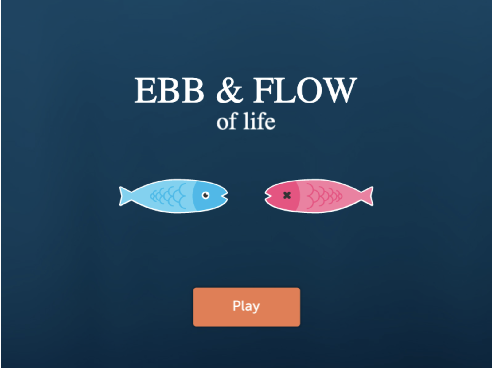

## Setup

1. Clone repository
2. CD into ebb-flow
3. Run `python -m SimpleHTTPServer` or `python3 -m http.server`
4. Navigate to `localhost:8000` to play

### How the game works:
Whenever the fish are blue, use your arrow keys to decode the way they're pointing. Whenever the fish are pink, use your arrow keys to decode the way they're moving.
